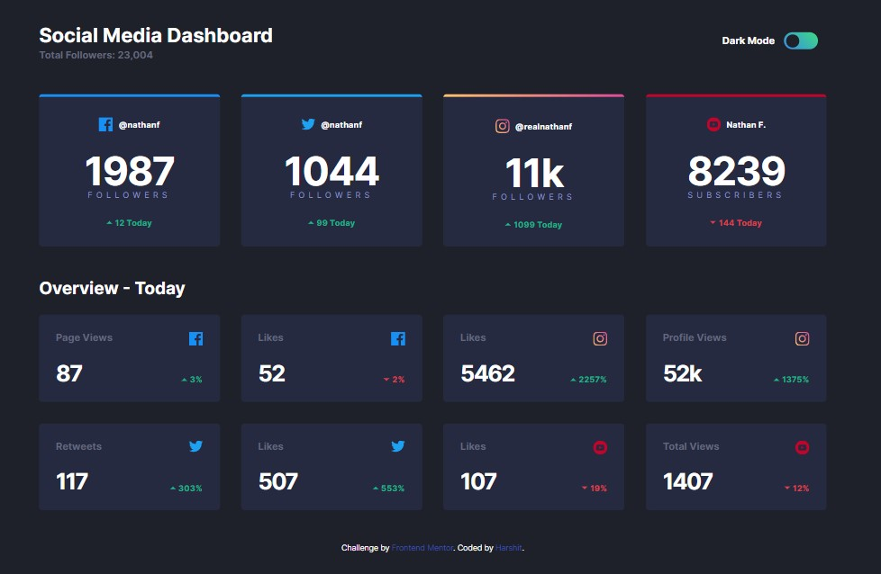
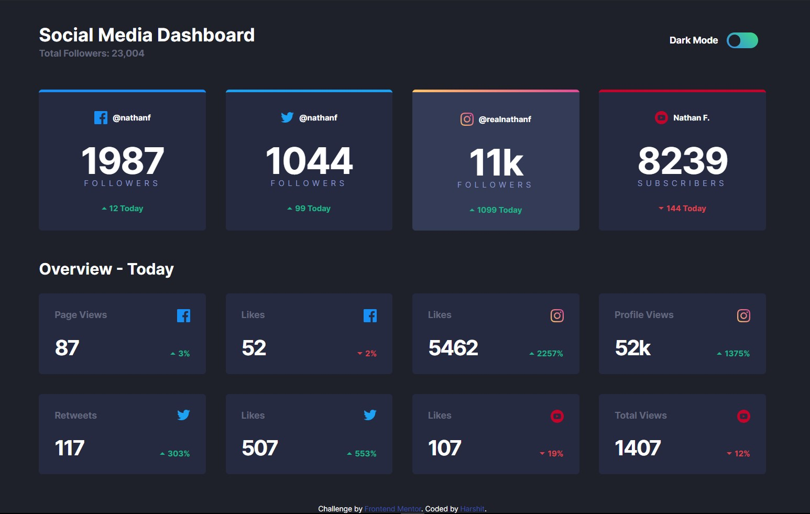
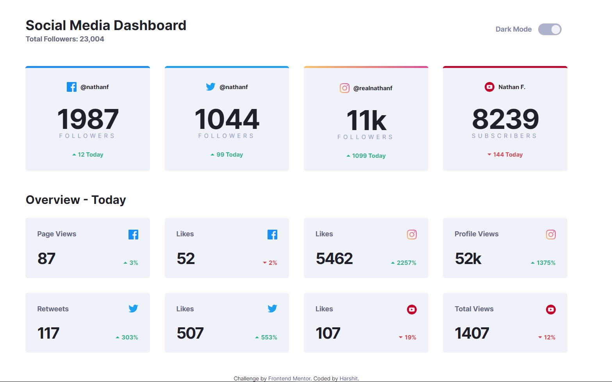
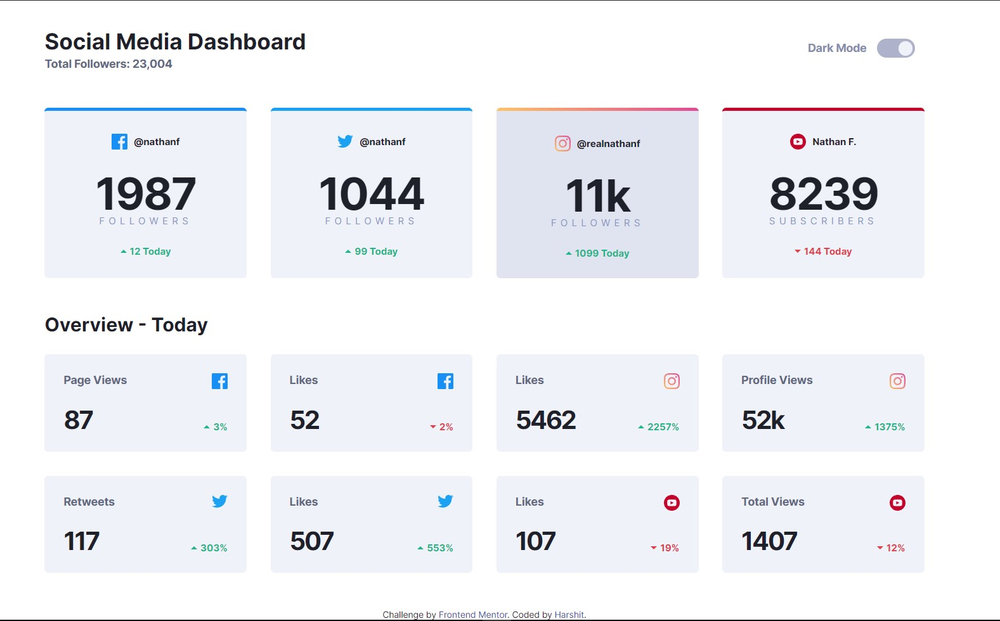

# Social Media Dashboard

This project is a part of my journey to improve my programming skills by building realistic projects.

## Table of contents

- [Overview](#overview)
  - [The challenge](#the-challenge)
  - [Screenshots](#screenshots)
  - [Links](#links)
  - [My process](#my-process)
  - [Built with](#built-with)
  - [What I learned](#what-i-learned)
  - [Continued development](#continued-development)
  - [Useful resources](#useful-resources)
- [Author](#author)
- [Acknowledgments](#acknowledgments)

## Overview

This aims to provide users with an optimal layout based on their device's screen size. The project also includes hover states for interactive elements and the ability to toggle the color theme according to user preference.

### The challenge

Users should be able to:

- View the optimal layout for the site depending on their device's screen size
- See hover states for all interactive elements on the page
- Toggle color theme to their preference

### Screenshots

| Dark Background | Dark Background with hover |
|---|---|
|  |  |
| Light Background | Light Background with hover |
|  |  |

### Links

- [Live Demo](https://example.com)
- [GitHub Repository](https://github.com/yourusername/your-repo)

### My process

In my process, I started by analyzing the requirements and creating a wireframe for the social media dashboard. Then, I implemented the layout using semantic HTML5 markup and applied CSS custom properties for styling. I utilized both Flexbox and CSS Grid to achieve the desired responsive design. Additionally, I added hover states to interactive elements and implemented a color theme toggle feature based on user preference.

### Built with

- Semantic HTML5 markup
- CSS custom properties
- Flexbox
- CSS Grid
- SCSS
- JavaScript

### What I learned

Throughout this project, I learned how to create a responsive layout using Flexbox and CSS Grid. I also gained experience in implementing hover states and incorporating user preferences for color themes.

### Continued development

In future projects, I would like to further enhance my skills in JavaScript and explore frameworks such as React to build more interactive and dynamic web applications.

### Useful resources

- [CSS Variables (custom properties)](https://css-tricks.com/updating-a-css-variable-with-javascript/) - A comprehensive guide on how to use CSS variables (custom properties) to create responsive web designs.
- [Switching between light/dark modes](https://developer.mozilla.org/en-US/docs/Web/CSS/@media/prefers-color-scheme) - A comprehensive guide on how to implement light and dark modes using CSS variables and the `prefers-color-scheme` media query.

## Author

- Website - [Add your name](#)
- Twitter - [@yourusername](#)

## Acknowledgments

I would like to acknowledge the support and guidance of my mentors throughout this project.
